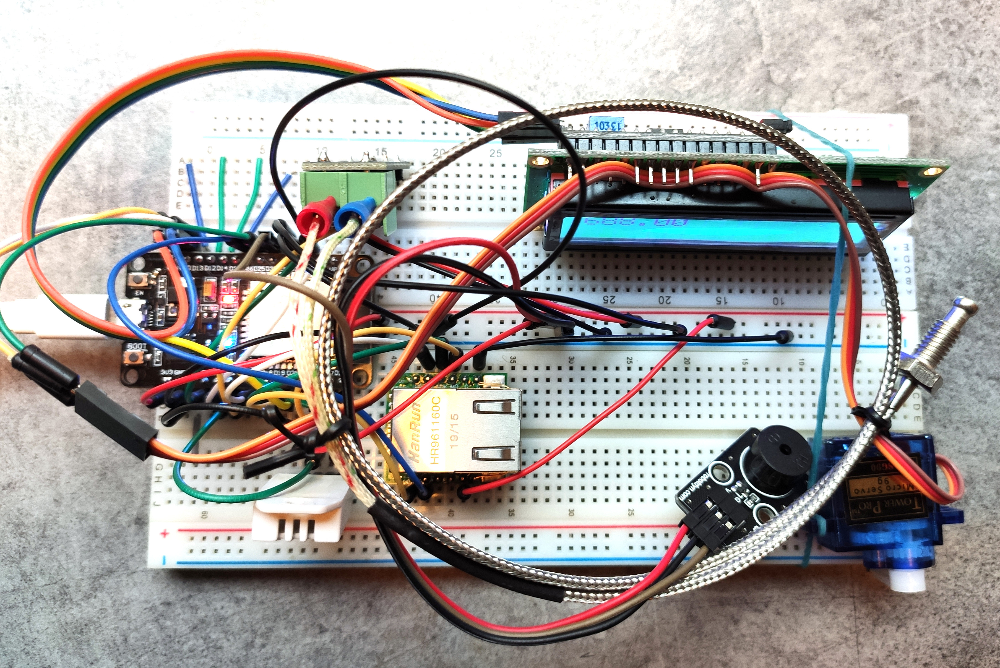
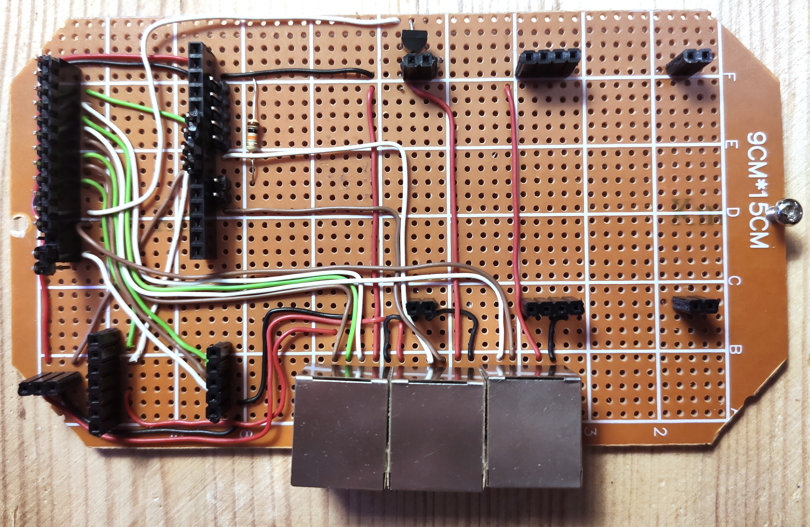
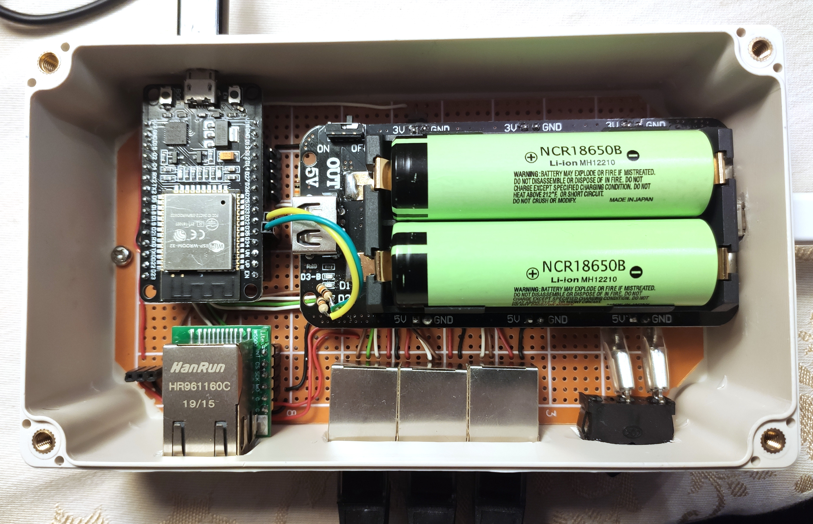
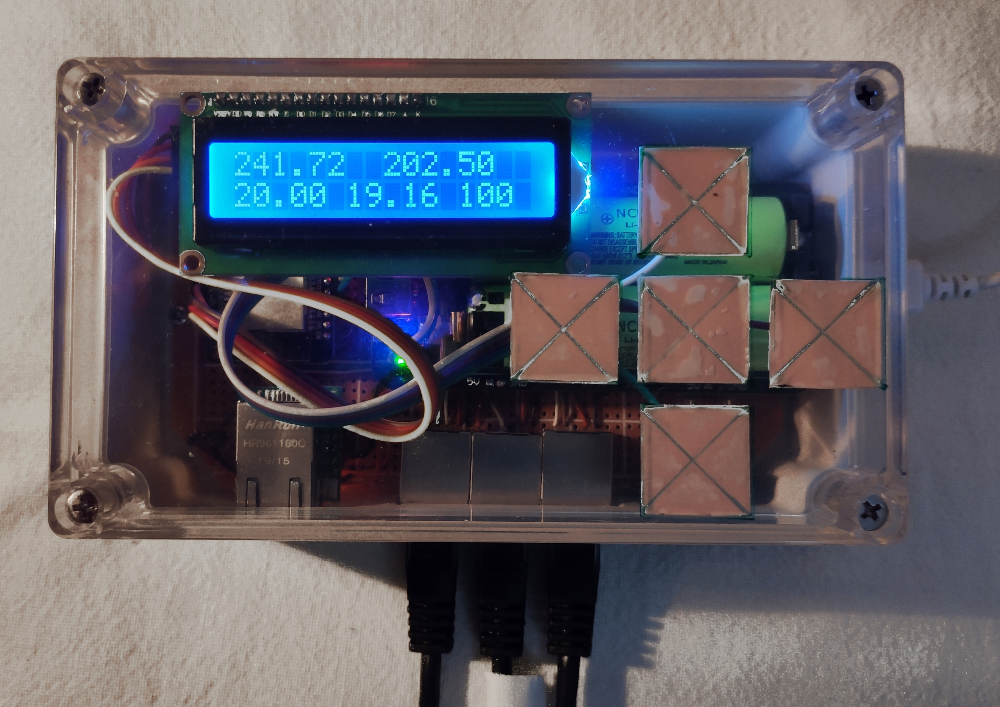

# A fireplace stove controller, based on a microcontroller (or a computer platform), compliant with the Web Thing API draft specification

Sterownik pieca kominkowego, w oparciu o mikrokontroler (lub platformę komputerową), zgodny ze szkicem specyfikacji Web Thing API

This work focuses on developing concept of building a fireplace stove controller and dedicated software. The research reveals that there are no devices providing public API on the market which disenable exchange of information, as well as taking interactions. Therefore, controller was developed using potencial W3C specification, which describes a common data model and API for the Web of Things. The thesis contains the description of the device’s construction from chosen units. Moreover, it documents creation of software implementing Web Thing API.

### Testing the arrangement of elements on the breadboard

### Development board prepared

### Inside the controller

### The controller

